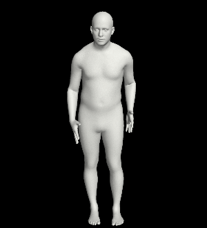

# VPoser: Variational Human Pose Prior

## Description
The articulated 3D pose of the human body is high-dimensional and complex. 
Many applications make use of a prior distribution over valid human poses, but modeling this distribution is difficult.
Here we provide a learned distribution trained from a large dataset of human poses represented as SMPL bodies.

Here we present a method that is used in [SMPLify-X](https://smpl-x.is.tue.mpg.de/). 
Our variational human pose prior, named VPoser, has the following features: 
 - defines a prior of SMPL pose parameters
 - is end-to-end differentiable
 - provides a way to penalize impossible poses while admitting valid ones
 - effectively models correlations among the joints of the body
 - introduces an efficient, low-dimensional, representation for human pose
 - can be used to generate valid 3D human poses for data-dependent tasks

## Table of Contents
  * [Description](#description)
  * [Installation](#installation)
  * [Loading trained models](#loading-trained-models) 
  * [Train VPoser](#train-vposer)
  * [Tutorials](#tutorials)
  * [Citation](#citation)
  * [License](#license)
  * [Acknowledgments](#acknowledgments)
  * [Contact](#contact)
  * [FAQ](https://github.com/nghorbani/human_body_prior/wiki/FAQ)

## Installation
**Requirements**
- Python 3.7
- [Configer](https://github.com/nghorbani/configer)
- [PyTorch 1.1.0](https://pytorch.org/get-started/previous-versions/)
- [Torchgeometry 0.1.2](https://pypi.org/project/torchgeometry/0.1.2/)
- [Pyrender](https://pyrender.readthedocs.io/en/latest/install/index.html#osmesa) for visualizations

Install from this repository for the latest developments:
```bash
pip install git+https://github.com/nghorbani/human_body_prior
```

**Optional dependencies:**

If you want to use the feature to [Disentangle Self-Intersecting Poses](https://github.com/nghorbani/human_body_prior/tree/master/human_body_prior/body_model#disentangling-self-intersecting-novel-poses)
please install the optional package [mesh_intersection](https://github.com/vchoutas/torch-mesh-isect).

## Loading Trained Models

To download the trained *VPoser*  models go to the [SMPL-X project website](https://smpl-x.is.tue.mpg.de/) and register to get access to the downloads section. Afterwards, you can follow the [model loading tutorial](notebooks/vposer_poZ.ipynb) to load and use your trained VPoser models.

## Train VPoser
We train VPoser, using a [variational autoencoder](https://arxiv.org/abs/1312.6114)
that learns a latent representation of human pose and regularizes the distribution of the latent code to be a normal distribution.
We train our prior on data from the [AMASS](https://amass.is.tue.mpg.de/) dataset; 
specifically, the SMPL pose parameters of various publicly available human motion capture datasets. 
You can follow the [data preparation tutorial](human_body_prior/data/README.md) to learn how to download and prepare AMASS for VPoser.
Afterwards, you can [train VPoser from scratch](human_body_prior/train/README.md). 

## Tutorials



* [VPoser PoZ Space for Body Models](notebooks/vposer_poZ.ipynb)
* [Sampling Novel Body Poses from VPoser](notebooks/vposer_sampling.ipynb)
* [Preparing VPoser Training Dataset](human_body_prior/data/README.md)
* [Train VPoser from Scratch](human_body_prior/train/README.md)

## Citation
Please cite the following paper if you use this code directly or indirectly in your research/projects:
```
@inproceedings{SMPL-X:2019,
  title = {Expressive Body Capture: 3D Hands, Face, and Body from a Single Image},
  author = {Pavlakos, Georgios and Choutas, Vasileios and Ghorbani, Nima and Bolkart, Timo and Osman, Ahmed A. A. and Tzionas, Dimitrios and Black, Michael J.},
  booktitle = {Proceedings IEEE Conf. on Computer Vision and Pattern Recognition (CVPR)},
  year = {2019}
}
```
Also note that if you consider training your own VPoser for your research using the AMASS dataset, 
then please follow its respective citation guideline.
 
## License

Software Copyright License for **non-commercial scientific research purposes**.
Please read carefully the [terms and conditions](./LICENSE) and any accompanying documentation before you download and/or use the SMPL-X/SMPLify-X model, data and software, (the "Model & Software"), including 3D meshes, blend weights, blend shapes, textures, software, scripts, and animations. By downloading and/or using the Model & Software (including downloading, cloning, installing, and any other use of this github repository), you acknowledge that you have read these terms and conditions, understand them, and agree to be bound by them. If you do not agree with these terms and conditions, you must not download and/or use the Model & Software. Any infringement of the terms of this agreement will automatically terminate your rights under this [License](./LICENSE).

## Contact
The code in this repository is developed by [Nima Ghorbani](https://nghorbani.github.io/).

If you have any questions you can contact us at [smplx@tuebingen.mpg.de](mailto:smplx@tuebingen.mpg.de).

For commercial licensing, contact [ps-licensing@tue.mpg.de](mailto:ps-licensing@tue.mpg.de)

## Acknowledgments
We thank the authors of [AMASS](https://amass.is.tue.mpg.de/) for their early release of their dataset for this project.
We thank [Partha Ghosh](https://ps.is.tuebingen.mpg.de/person/pghosh) for disscussions and insights that helped with this project.
